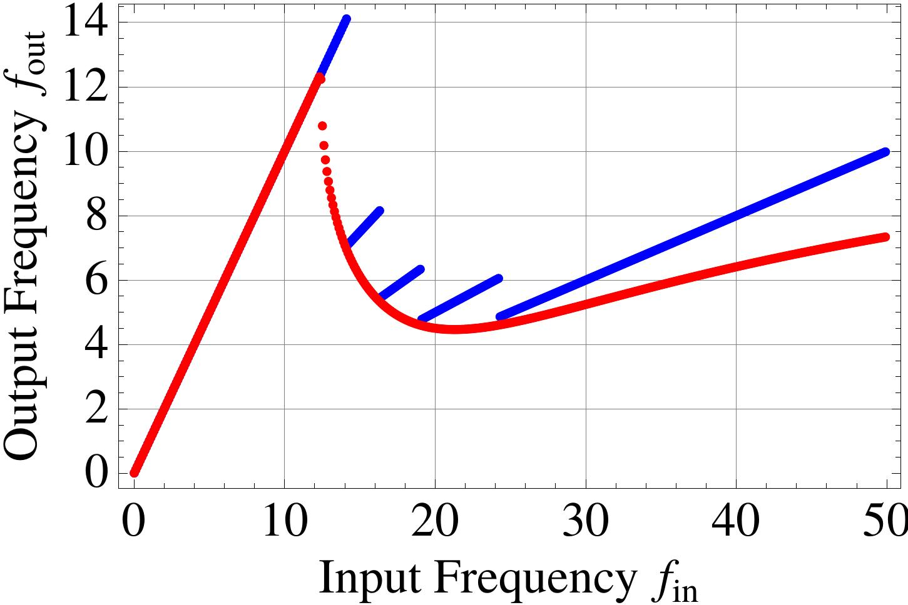

# NoEvent
Spike-time based simulation of a network of neurons. 
- Variable topology
- Adjustable synapse models

I used this to investigate synchronization and non-monotonicity of Leaky/Quadratic-Integrate-and-fire neuron models with resource-limited synapses.

